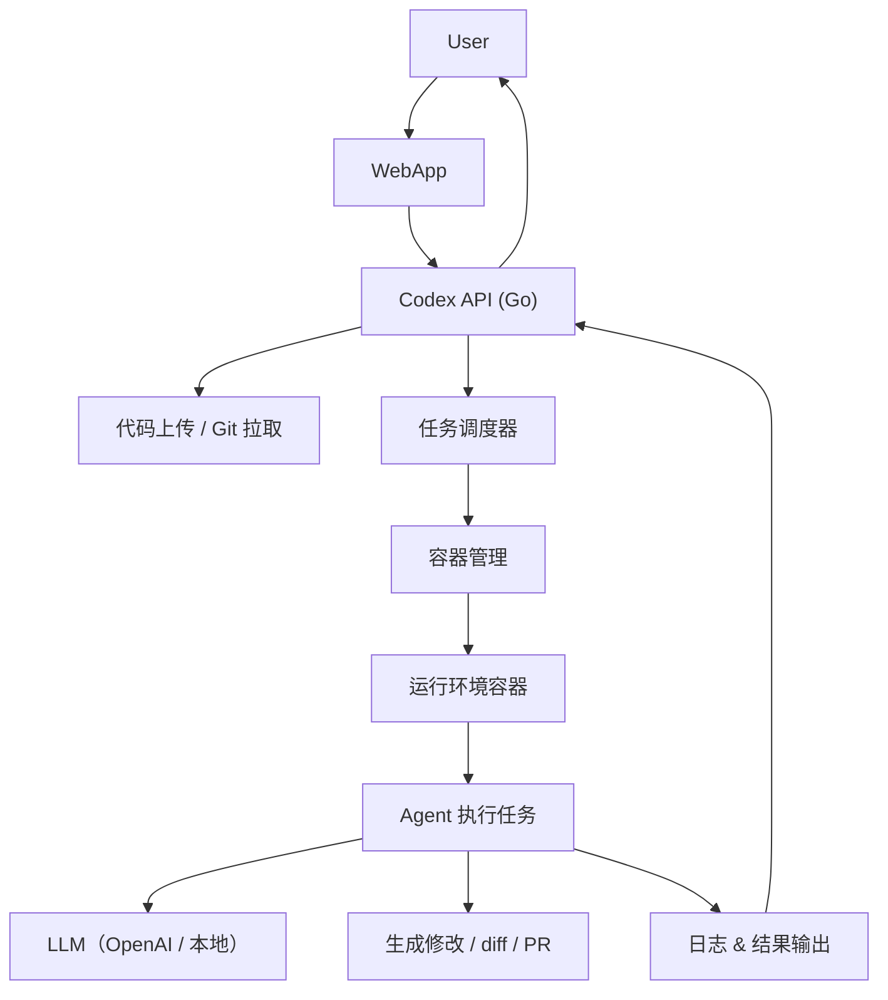

# Codex-like SYS

## 🎯 场景描述

> **用户访问你的平台** → **托管自己的代码仓库**（GitHub / 本地上传） → **系统将代码放入容器中** → **启动 Agent（模型）分析、修改或生成 PR 等任务**。

构建一个“**AI 代码工作站平台**”，支持代码托管 → 容器化运行 → LLM 助手操作代码！

---

## ✅ 核心目标功能(正在实现中)

| 步骤 | 功能 |
|------|------|
| 1️⃣ 用户上传或托管代码仓库 | 可通过 Git URL 或上传 zip |
| 2️⃣ 将代码放入隔离的容器中 | 创建每个任务的独立容器（如 Docker） |
| 3️⃣ 容器中运行 Agent | 拉起一个 Agent，载入代码，执行任务 |
| 4️⃣ Agent 调用 LLM | 如 OpenAI、Claude、CodeLlama 等 |
| 5️⃣ 获取结果：修改代码 / diff / PR | 返回结果给用户，可生成 patch 或 PR |
| 6️⃣ 提供任务日志 & 分享链接 | 任务详情、日志、diff 下载，甚至 Web UI |

---

## 🧱 系统结构图（Codex-like 架构）


---

## 🧱 容器运行模型参考（每个任务一容器）

| 容器内容 | 描述 |
|----------|------|
| ✅ 用户代码 | Git clone 或 zip 解压 |
| ✅ AGENTS.md | 用户自定义 agent 指令（可选） |
| ✅ setup.sh | 用于初始化环境 |
| ✅ agent.go / agent.py | 你的任务执行器，调用 LLM |
| ✅ 环境依赖 | Python、Go、Node 等 |
| ⛔ 无互联网 | 执行阶段断网，安全隔离（可选） |

---

## ✅ 示例流程：从用户到 Agent 执行

1. 用户上传仓库或输入 GitHub URL
2. 后端克隆代码 / 解压 zip 到临时目录
3. 调用 Docker API 启动一个容器：
   - 挂载代码目录
   - 执行 setup.sh（如果存在）
   - 启动 agent.go / agent.py 来处理任务
4. agent 调用 OpenAI API（或本地模型）
5. 生成结果（解释、修改、diff、PR）
6. 容器停止，日志和结果保存本地
7. 通过 Web 返回链接或结果给用户

---

## 🧪 Docker 容器管理（Go 示例）

用 [Docker SDK for Go](https://github.com/docker/docker/client) 启动任务容器：

```go
import "github.com/docker/docker/client"

func RunAgentContainer(repoPath string, task string, mode string) (string, error) {
    cli, err := client.NewClientWithOpts(client.FromEnv)
    if err != nil {
        return "", err
    }

    // 创建容器配置
    containerConfig := &container.Config{
        Image: "your-codex-image",
        Cmd:   []string{"./agent", "--task", task, "--mode", mode},
        Env:   []string{"OPENAI_API_KEY=sk-xxx"},
    }

    hostConfig := &container.HostConfig{
        Binds: []string{repoPath + ":/app/code"},
    }

    // 创建容器
    resp, err := cli.ContainerCreate(context.Background(), containerConfig, hostConfig, nil, nil, "")
    if err != nil {
        return "", err
    }

    // 启动容器
    if err := cli.ContainerStart(context.Background(), resp.ID, types.ContainerStartOptions{}); err != nil {
        return "", err
    }

    return resp.ID, nil
}
```

---

## 🚀 Agent 执行器（容器内运行）

一个容器内的 `agent.py` 或 `agent.go`，它会：

1. 读取 task.json 或命令行参数
2. 加载代码文件 / AGENTS.md
3. 构造 prompt 调用 LLM
4. 输出结果：解释、修改、diff、PR

---

## 📦 Dockerfile 示例（容器镜像）

```Dockerfile
FROM ubuntu:24.04

RUN apt update && apt install -y \
    curl git python3 python3-pip

WORKDIR /app
COPY . /app

RUN pip install openai difflib

CMD ["python3", "agent.py"]
```

---

## 📁 agent.py 示例（容器内）

```python
import openai, os, sys, difflib

openai.api_key = os.getenv("OPENAI_API_KEY")

def main():
    task = sys.argv[1]
    mode = sys.argv[2]
    with open("/app/code/main.go") as f:
        code = f.read()

    prompt = f"Task: {task}\n\nCode:\n{code}"
    response = openai.ChatCompletion.create(
        model="gpt-4",
        messages=[{"role": "user", "content": prompt}]
    )

    new_code = response.choices[0].message.content
    diff = difflib.unified_diff(code.splitlines(), new_code.splitlines(), lineterm="")

    with open("/app/output/diff.patch", "w") as out:
        out.write("\n".join(diff))

if __name__ == "__main__":
    main()
```

---

## ✅ 日志与分享链接

- 每次任务在 `logs/<task_id>` 目录下保存：
  - `prompt.txt`
  - `llm_response.txt`
  - `diff.patch`
  - `setup.log`
- 显示链接如：
  - `https://codex-sys.com/logs/20250517_xyz/diff.patch`

---

## ✅ 安全性
| 容器沙箱 | 每个任务一个容器，执行后销毁 |
| 网络限制 | setup 阶段可以联网，agent 执行阶段禁网（可选） |
| 权限控制 | 不允许执行非白名单脚本 |
| LLM API | 使用代理或限速策略 |

---

## 下一步

1. ✅ **提供完整的 Docker + Go 示例项目（GitHub 模板）**
2. ✅ **打包 Agent 容器（Dockerfile + 代码）**
3. ✅ **提供 Web API 示例（/task 接口 + 状态轮询）**
4. ✅ **加上 PR 创建功能（使用 GitHub Token）**
5. ✅ **整合前端页面（可选）**

