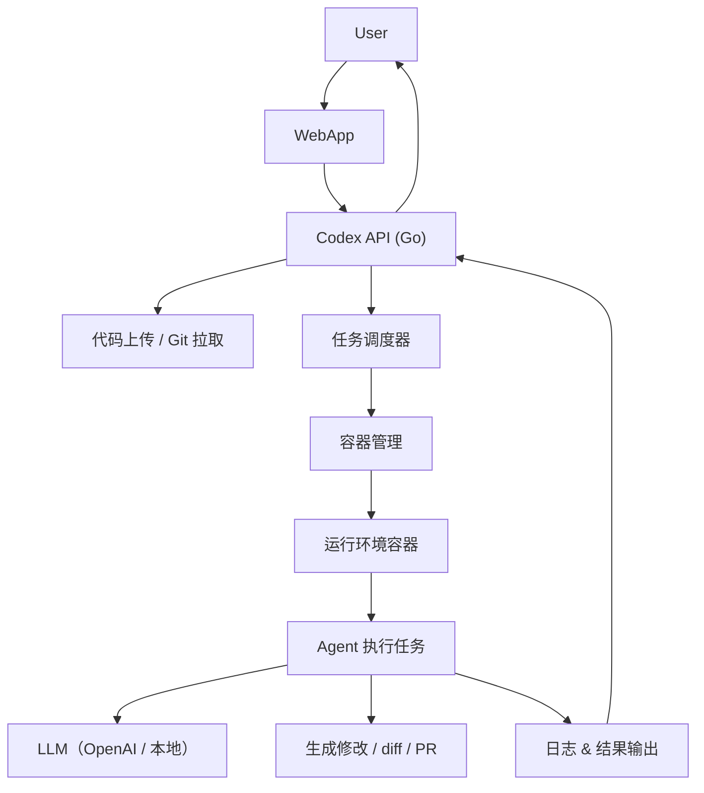

# Codex-like SYS 开发指南

## 🎯 场景描述

> **用户访问codex** → **托管自己的代码仓库**（GitHub / 本地上传） → **系统将代码放入容器中** → **启动 Agent（模型）分析、修改或生成 PR 等任务**。

构建一个“**AI 代码工作站平台**”，支持代码托管 → 容器化运行 → LLM 助手操作代码！

---

## ✅ 核心目标功能(正在实现中)

| 步骤 | 功能 |
|------|------|
| 1️⃣ 用户上传或托管代码仓库 | 可通过 Git URL 或上传 zip |
| 2️⃣ 将代码放入隔离的容器中 | 创建每个任务的独立容器（如 Docker） |
| 3️⃣ 容器中运行 Agent | 拉起一个 Agent，载入代码，执行任务 |
| 4️⃣ Agent 调用 LLM | 如 OpenAI、Claude、deepseek 等 |
| 5️⃣ 获取结果：修改代码 / diff / PR | 返回结果给用户，可生成 patch 或 PR |
| 6️⃣ 提供任务日志 & 分享链接 | 任务详情、日志、diff 下载，甚至 Web UI |

---

## 🧱 系统结构图（Codex-like 架构）


---

## 🧱 容器运行模型参考（每个任务一容器）

| 容器内容 | 描述 |
|----------|------|
| ✅ 用户代码 | Git clone 或 zip 解压 |
| ✅ AGENTS.md | 用户自定义 agent 指令（可选） |
| ✅ setup.sh | 用于初始化环境 |
| ✅ agent.go / agent.py | 你的任务执行器，调用 LLM |
| ✅ 环境依赖 | Python、Go、Node 等 |
| ⛔ 无互联网 | 执行阶段断网，安全隔离（可选） |

---

## ✅ 示例流程：从用户到 Agent 执行

1. 用户上传仓库或输入 GitHub URL
2. 后端克隆代码 / 解压 zip 到临时目录
3. 调用 Docker API 启动一个容器：
    - 挂载代码目录
    - 执行 setup.sh（如果存在）
    - 启动 agent.go / agent.py 来处理任务
4. agent 调用 OpenAI API（或本地模型）
5. 生成结果（解释、修改、diff、PR）
6. 容器停止，日志和结果保存本地
7. 通过 Web 返回链接或结果给用户

---

## 🧪 Docker 容器管理（Go 示例）

用 [Docker SDK for Go](https://github.com/docker/docker/client) 启动任务容器：

```go
import "github.com/docker/docker/client"

func RunAgentContainer(repoPath string, task string, mode string) (string, error) {
    cli, err := client.NewClientWithOpts(client.FromEnv)
    if err != nil {
        return "", err
    }

    // 创建容器配置
    containerConfig := &container.Config{
        Image: "your-codex-image",
        Cmd:   []string{"./agent", "--task", task, "--mode", mode},
        Env:   []string{"OPENAI_API_KEY=sk-xxx"},
    }

    hostConfig := &container.HostConfig{
        Binds: []string{repoPath + ":/app/code"},
    }

    // 创建容器
    resp, err := cli.ContainerCreate(context.Background(), containerConfig, hostConfig, nil, nil, "")
    if err != nil {
        return "", err
    }

    // 启动容器
    if err := cli.ContainerStart(context.Background(), resp.ID, types.ContainerStartOptions{}); err != nil {
        return "", err
    }

    return resp.ID, nil
}
```

---

## 🚀 Agent 执行器（容器内运行）

一个容器内的 `agent.py` 或 `agent.go`，它会：

1. 读取 task.json 或命令行参数
2. 加载代码文件 / AGENTS.md
3. 构造 prompt 调用 LLM
4. 输出结果：解释、修改、diff、PR

---

## 📦 Dockerfile 示例（容器镜像）

```Dockerfile
FROM ubuntu:24.04

RUN apt update && apt install -y \
    curl git python3 python3-pip

WORKDIR /app
COPY . /app

RUN pip install openai difflib

CMD ["python3", "agent.py"]
```

---

## 📁 agent.py 示例（容器内）

```python
import openai, os, sys, difflib

openai.api_key = os.getenv("OPENAI_API_KEY")

def main():
    task = sys.argv[1]
    mode = sys.argv[2]
    with open("/app/code/main.go") as f:
        code = f.read()

    prompt = f"Task: {task}\n\nCode:\n{code}"
    response = openai.ChatCompletion.create(
        model="gpt-4",
        messages=[{"role": "user", "content": prompt}]
    )

    new_code = response.choices[0].message.content
    diff = difflib.unified_diff(code.splitlines(), new_code.splitlines(), lineterm="")

    with open("/app/output/diff.patch", "w") as out:
        out.write("\n".join(diff))

if __name__ == "__main__":
    main()
```

---

## ✅ 日志与分享链接

- 每次任务在 `logs/<task_id>` 目录下保存：
    - `prompt.txt`
    - `llm_response.txt`
    - `diff.patch`
    - `setup.log`
- 显示链接如：
    - `https://codex-sys.com/logs/20250517_xyz/diff.patch`

---

## ✅ 安全性
| 容器沙箱 | 每个任务一个容器，执行后销毁 |
| 网络限制 | setup 阶段可以联网，agent 执行阶段禁网（可选） |
| 权限控制 | 不允许执行非白名单脚本 |
| LLM API | 使用代理或限速策略 |


---

## 🚀 架构蓝图：分布式 Codex-like 系统 🚀

```mermaid
graph LR
    subgraph "用户侧"
        UserInterface[前端 UI / API 客户端]
    end

    subgraph "API 层 (可水平扩展)"
        APIGateway[API 网关 (Nginx)]
        APIService1[Codex API 服务 1 (Go)]
        APIService2[Codex API 服务 2 (Go)]
        APIServiceN[Codex API 服务 N (Go)]
    end

    subgraph "数据持久化层"
        MySQLDB[(MySQL - 任务元数据)]
        RedisCache[(Redis - 任务状态缓存/锁)]
    end

    subgraph "消息队列"
        KafkaCluster[Kafka 集群]
        TaskTopic[任务主题 (e.g., codex-tasks)]
        ResultTopic[结果主题 (e.g., codex-results)]
    end

    subgraph "Worker 层 (Kubernetes 管理)"
        K8sCluster[Kubernetes 集群]
        WorkerDeployment[Worker 服务 Deployment (Go)]
        WorkerPod1[Worker Pod 1] --> AgentContainer1[Agent Docker 容器]
        WorkerPod2[Worker Pod 2] --> AgentContainer2[Agent Docker 容器]
        WorkerPodN[Worker Pod N] --> AgentContainerN[Agent Docker 容器]
    end

    subgraph "分布式存储"
        COS[腾讯云 COS]
        COSCodeBucket[代码存储桶 (repos)]
        COSLogsBucket[日志存储桶 (logs)]
    end

    UserInterface --> APIGateway
    APIGateway --> APIService1
    APIGateway --> APIService2
    APIGateway --> APIServiceN

    APIService1 --> MySQLDB
    APIService1 --> RedisCache
    APIService1 -- 发布任务 --> TaskTopic

    APIService2 --> MySQLDB
    APIService2 --> RedisCache
    APIService2 -- 发布任务 --> TaskTopic

    APIServiceN --> MySQLDB
    APIServiceN --> RedisCache
    APIServiceN -- 发布任务 --> TaskTopic

    TaskTopic -- 消费任务 --> WorkerPod1
    TaskTopic -- 消费任务 --> WorkerPod2
    TaskTopic -- 消费任务 --> WorkerPodN

    WorkerPod1 -- 操作 --> COS
    WorkerPod2 -- 操作 --> COS
    WorkerPodN -- 操作 --> COS

    WorkerPod1 -- 更新状态 --> MySQLDB
    WorkerPod1 -- 更新状态 --> RedisCache
    WorkerPod1 -- 发布结果 --> ResultTopic

    ResultTopic -- (可选) API 服务订阅 --> APIService1

    %% K8s 管理 Agent 容器的细节
    %% WorkerPod1 -.-> DockerSpawnerK8s[K8s Docker Spawner]
    %% DockerSpawnerK8s -.-> AgentContainer1
```

**核心流程变化：**

1.  **任务创建 (API 服务):**
    *   用户通过 API 网关向任一 `APIService` 实例提交任务。
    *   `APIService`:
        *   验证请求。
        *   生成任务 ID。
        *   将任务元数据（不包括代码本身）存入 `MySQLDB` (状态：`PENDING` 或 `QUEUED`)。
        *   如果用户上传的是 ZIP 文件，`APIService` 将其**直接上传到 `COSCodeBucket`** 中的一个临时位置 (e.g., `tmp_zips/<task_id>/code.zip`)。
        *   将包含任务 ID、COS 上的代码位置（Git URL 或 ZIP 文件在 COS 上的路径）、任务描述等信息的**消息发布到 Kafka 的 `TaskTopic`**。
        *   （可选）在 `RedisCache` 中设置任务的初始状态。
        *   向用户返回任务 ID 和一个轮询状态的端点。

2.  **任务处理 (Worker 服务 - K8s Pods):**
    *   `WorkerDeployment` 在 Kubernetes 中运行多个 `WorkerPod` 实例。
    *   每个 `WorkerPod` (Go 程序) 都是 Kafka `TaskTopic` 的消费者。
    *   当 `WorkerPod` 收到一个任务消息：
        *   更新 `MySQLDB` 和 `RedisCache` 中的任务状态为 `PROCESSING` (或更细化的状态，如 `DOWNLOADING_CODE`)。
        *   **代码获取：**
            *   如果任务是 Git URL，Worker 直接在 Pod 内或临时 Volume 中 `git clone`。
            *   如果任务是 ZIP，Worker 从 `COSCodeBucket` (e.g., `tmp_zips/<task_id>/code.zip`) **下载 ZIP 文件**到 Pod 内或临时 Volume，然后解压。
        *   **准备 Agent 容器的输入：**
            *   将处理后的代码（克隆或解压后）**上传到 `COSCodeBucket`** 的一个任务专属路径 (e.g., `processed_code/<task_id>/`)。Worker 需要确保 Agent 容器能够访问这些代码。
        *   **启动 Agent 容器 (通过 Kubernetes API):**
            *   Worker 不再直接调用 Docker SDK。它会**创建一个 Kubernetes `Job` 或 `Pod`**。
            *   这个 K8s `Job/Pod` 的定义会包含：
                *   Agent Docker 镜像 (`codex-agent:latest`)。
                *   环境变量 (API Keys, 任务参数)。
                *   **Volume 挂载：**
                    *   **代码输入：** 使用 CSI (Container Storage Interface)驱动程序直接从 `COSCodeBucket` 挂载代码到容器的 `/app/code` (例如，使用 `goofys` 或腾讯云的 `cosfs` CSI 插件)，或者 Worker 先下载代码到 K8s `emptyDir` 或 `PersistentVolumeClaim`，再挂载给 Agent Pod。后者更常见，因为 Agent 可能需要写权限。
                    *   **日志输出：** 挂载一个 `emptyDir` 或 `PVC` 到容器的 `/app/output`。
        *   Worker 监控 K8s `Job/Pod` 的状态。

3.  **Agent 执行 (K8s 内的容器):**
    *   Agent 容器如常运行，读取 `/app/code` 中的代码，执行任务。
    *   所有输出 (logs, diff, prompt.txt 等) 写入到 `/app/output`。

4.  **结果收集与状态更新 (Worker 服务):**
    *   当 Agent K8s `Job/Pod` 完成后：
        *   Worker 从 `/app/output` 挂载的 Volume 中收集所有日志和结果文件。
        *   将这些文件**上传到 `COSLogsBucket`** (e.g., `logs/<task_id>/diff.patch`)。
        *   更新 `MySQLDB` 和 `RedisCache` 中的任务状态为 `COMPLETED` 或 `FAILED`，并存储 COS 上日志文件的链接或PR链接。
        *   （可选）将任务完成的简要信息（如任务 ID、状态、结果摘要的 COS 路径）发布到 Kafka 的 `ResultTopic`。API 服务或其他下游服务可以订阅此主题。

5.  **用户获取结果 (API 服务):**
    *   用户轮询 API 服务的状态接口。
    *   `APIService` 从 `RedisCache` (快速路径) 或 `MySQLDB` (持久路径) 获取任务状态。
    *   如果任务完成，API 服务返回指向 `COSLogsBucket` 中结果文件的**预签名 URL** 或通过 API 代理下载这些文件。

---
### 2. worker
This would be a separate Go application, built into a Docker image, and deployed on Kubernetes.

---

### 3. `agent/` (Agent - Python)

No major changes are strictly *required* in the agent for this backend refactor, as long as:
*   It still receives code in `/app/code`.
*   It can still write logs/outputs to `/app/output`.
*   Environment variables (like `OPENAI_API_KEY`, `GITHUB_TOKEN`) are correctly passed.

**However, to integrate with COS for output uploading from the Agent Pod (if not using a sidecar):**

The Agent Pod's main container (or a post-stop lifecycle hook) would need:
1.  COS credentials (e.g., via K8s secrets mounted as env vars or files, or using Workload Identity/IRSA).
2.  A COS SDK or CLI tool (like `aws s3 sync` or `coscmd`) installed in the agent image.
3.  Logic at the end of `agent.py` (or in a wrapper script) to upload the contents of `/app/output` to the designated `OutputCOSPath` (which would need to be passed as an env var to the agent).

**Example snippet for agent.py to upload output (conceptual):**

This upload logic is often better handled by a K8s sidecar container or a post-run script defined in the K8s Job spec to keep the agent focused on its core task.

---

### Deployment Considerations:

*   **Configuration:** Each service (API, Worker) will need its own configuration management (env vars, config files, K8s ConfigMaps/Secrets).
*   **Docker Images:** You'll build separate Docker images for the API service, the Worker service, and the Agent.
*   **Kubernetes Manifests:** You'll need K8s `Deployment` YAMLs for the API and Worker services, `Service` YAMLs to expose them, and a way to define the Agent `Job` (perhaps the Worker generates the Job spec dynamically).
*   **Database Setup:** MySQL schema needs to be applied. Redis setup.
*   **Kafka Setup:** Topics (`codex-tasks`, `codex-results`) need to be created.
*   **COS Buckets:** `your-code-bucket` and `your-logs-bucket` need to be created with appropriate permissions.
*   **IAM/Permissions:**
    *   API service might need permission to write to COS (for initial ZIP uploads).
    *   Worker service needs permission to read/write to COS, interact with Kubernetes API (create Jobs, get Job status), and read/write to MySQL/Redis.
    *   Agent Pods (if they handle their own COS interactions via CSI or direct SDK calls) need COS read (for code) and write (for logs) permissions. This is often managed via K8s Service Accounts + IRSA (AWS), Workload Identity (GCP/Azure), or OIDC federation with Tencent Cloud CAM.


