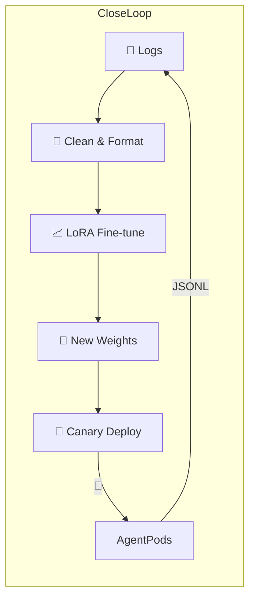

```mermaid
graph TD
    User --> PlatformUI[Codex-like Platform UI]

    subgraph "Backend Services (Go/Python)"
        APIService[API Service] --> TaskQueue[Task Queue (Kafka)]
        TaskQueue --> WorkerService[Worker Service (Manages K8s Jobs)]
        APIService --> MetadataDB[(MySQL/Postgres - Tasks, Feedback)]
        APIService --> VectorDBAdmin[VectorDB Admin Interface (Optional)]
        FineTuneDataService[Fine-tuning Data Service] --> FineTuneDataStore[(S3/COS - Raw Logs, Processed FT Data)]
    end

    subgraph "Knowledge & Code Indexing Pipeline (Offline/Periodic)"
        CodeSource[User Repos / Public Code] --> CodeParser[Code Parser (Tree-sitter)]
        CodeParser --> ChunkingLogic[Chunking & Structuring]
        ChunkingLogic --> EmbeddingModel[Code Embedding Model (e.g., CodeBERT, UniXcoder, OpenAI Ada)]
        EmbeddingModel --> VectorDB[(Vector DB - FAISS, Pinecone, Weaviate, Milvus)]
        CodeParser --> GraphDB[(Graph DB - Neo4j, for Code Structure/AST - Optional for GraphRAG)]
    end

    subgraph "Agent Core Logic (Python - Runs in K8s Pod)"
        AgentOrchestrator[Agent Orchestrator (MCP & CoT Logic)]

        subgraph "RAG Module"
            QueryPlannerRAG[RAG Query Planner]
            Retriever[Retriever (VectorDB Query, Keyword Search, Graph Traversal)]
            ReRanker[Re-Ranker (Cross-encoder / LLM)]
            ContextBuilderRAG[RAG Context Builder]
        end

        subgraph "LLM Interaction Module"
            LLMClient[LLM Client (Fine-tuned SWE-like model, Base model for CoT/Critique)]
            PromptEngine[Prompt Engineering Logic]
        end

        subgraph "Tool Execution Module (Function Calling)"
            ToolRegistry[Tool Registry & Dispatcher]
            LinterTool[Linter Tool Adapter]
            TestRunnerTool[Test Runner Adapter]
            FileEditorAST[File Editor (AST-based)]
            FileEditorText[File Editor (Text/Diff-based)]
            SearchTool[Web Search Tool Adapter]
            CommandRunner[General Command Runner]
        end

        UserCodeVolume[/app/code - User's Code]
        ASTCache[AST Cache (for frequently accessed files)]
    end

    subgraph "External Services & Models"
        OpenAI_API[OpenAI API (Embeddings, Base LLMs)]
        OSS_LLM_FineTuned[Self-hosted Fine-tuned OSS LLM (e.g., SWE-bench fine-tuned CodeLlama)]
        OSS_Embedding_Model[Self-hosted Embedding Model (Optional)]
    end


    %% Data Flow for a Task
    PlatformUI -- Task Request --> APIService
    WorkerService -- Spawns --> AgentOrchestrator

    AgentOrchestrator -- Initial Analysis / Query Planning --> QueryPlannerRAG
    QueryPlannerRAG -- Query --> Retriever
    Retriever -- Semantic Search --> VectorDB
    Retriever -- Keyword Search (Optional) --> CodeSource % Or an inverted index
    Retriever -- Graph Traversal (Optional) --> GraphDB
    Retriever -- Retrieved Chunks --> ReRanker
    ReRanker -- Ranked Chunks --> ContextBuilderRAG
    ContextBuilderRAG -- Augmented Context --> AgentOrchestrator

    AgentOrchestrator -- CoT Prompt / Task --> LLMClient
    LLMClient -- API Call --> OSS_LLM_FineTuned
    LLMClient -- API Call for Critique/Reasoning --> OpenAI_API % Or another instance of OSS_LLM
    OSS_LLM_FineTuned -- Response (Thought, Tool Call, Code) --> LLMClient
    LLMClient -- Parsed Response --> AgentOrchestrator

    AgentOrchestrator -- Tool Instruction --> ToolRegistry
    ToolRegistry -- Dispatch --> LinterTool
    ToolRegistry -- Dispatch --> TestRunnerTool
    ToolRegistry -- Dispatch --> FileEditorAST
    ToolRegistry -- Dispatch --> SearchTool
    LinterTool -- Executes Linter --> UserCodeVolume
    FileEditorAST -- Modifies AST --> UserCodeVolume
    FileEditorAST -- Updates --> ASTCache
    SearchTool -- External API Call --> Internet[Internet Search Engine]

    ToolRegistry -- Tool Result --> AgentOrchestrator

    AgentOrchestrator -- Final Code/Diff/PR --> PlatformUI % Via Backend
    AgentOrchestrator -- Logs for Fine-tuning --> FineTuneDataService

    %% Fine-tuning Loop
    FineTuneDataStore <-- User Feedback & Agent Logs -- PlatformUI
    FineTuneDataStore --> TrainingPipeline[OSS LLM Fine-tuning Pipeline (e.g., Axolotl, Llama-Factory)]
    TrainingPipeline -- Updates Model Weights --> OSS_LLM_FineTuned
```

---

## I. 高级 RAG (Retrieval Augmented Generation)

**目标：** 为 LLM 提供最相关、最精确的代码上下文，即使代码库非常庞大。

1.  **代码嵌入模型 (Code Embedding Models):**
    *   **专用模型：** `CodeBERT`, `GraphCodeBERT`, `UniXcoder`, `StarCoder Embeddings`。这些模型在代码数据上预训练，能更好地理解代码的语义和结构。
    *   **通用强力模型：** OpenAI `text-embedding-3-small/large`, `text-embedding-ada-002` 或其他 SOTA 文本嵌入模型。虽然通用，但对于代码的自然语言描述和部分代码片段效果依然不错。
    *   **选择：** 取决于您的具体需求、性能和成本。专用代码模型通常在纯代码检索上表现更好。

2.  **向量数据库 (Vector Database):**
    *   **选项：** FAISS (库), Pinecone (托管), Weaviate (开源), Milvus (开源), Qdrant (开源), ChromaDB (开源)。
    *   **作用：** 存储代码块的嵌入向量，并支持高效的近似最近邻 (ANN) 搜索。
    *   **实现思路 (Indexing):**
        ```python
        # Pseudocode for indexing
        from some_embedding_model import CodeEmbedder
        from some_vector_db_client import VectorDBClient
        from code_parser import parse_and_chunk_code # Uses tree-sitter

        embedder = CodeEmbedder(model_name="unixcoder-base") # Or your chosen model
        vector_db = VectorDBClient(config="...")

        def index_repository(repo_path):
            for file_path, code_content in iter_code_files(repo_path):
                chunks = parse_and_chunk_code(file_path, code_content) # Smart chunking
                for chunk in chunks:
                    # chunk = {"id": "repo/file.py#func_name", "code": "...", "metadata": {...}}
                    embedding = embedder.embed(chunk["code"])
                    vector_db.add(chunk["id"], embedding, chunk["metadata"])
        ```

3.  **复杂 RAG 策略：**
    *   **A. 混合搜索 (Hybrid Search):**
        *   **概念：** 结合向量语义搜索和传统的稀疏向量搜索（如 BM25/TF-IDF 关键词搜索）。
        *   **原因：** 语义搜索擅长理解意图，但可能错过精确的关键词匹配（如特定变量名、API 调用）。
        *   **实现思路:**
            ```python
            # Pseudocode for hybrid retrieval
            def hybrid_retrieve(query_text, k_semantic=5, k_keyword=5):
                semantic_results = vector_db.search(embedder.embed(query_text), top_k=k_semantic)
                keyword_results = keyword_index.search(query_text, top_k=k_keyword) # e.g., Elasticsearch

                # Combine and de-duplicate results
                combined_results = combine_and_deduplicate(semantic_results, keyword_results)
                return combined_results
            ```
    *   **B. 重排序 (Re-ranking):**
        *   **概念：** 在初步检索（召回）后，使用更强大（通常也更慢）的模型对召回的 Top-N 个结果进行重新排序，以提高最终上下文的精度。
        *   **模型：**
            *   **Cross-Encoders:** 如 `ms-marco-MiniLM-L-12-v2` 或针对代码训练的 cross-encoder。它们同时处理 (query, document) 对，比双编码器（用于嵌入）更精确。
            *   **LLM Re-ranking:** 使用一个小型 LLM，给它 query 和每个召回的文档，让它判断相关性或打分。
        *   **实现思路:**
            ```python
            # Pseudocode for re-ranking
            from some_cross_encoder import CrossEncoder

            reranker = CrossEncoder(model_name="...") # Or an LLM client

            def rerank_results(query_text, initial_results):
                query_doc_pairs = [(query_text, doc["code"]) for doc in initial_results]
                scores = reranker.predict(query_doc_pairs) # Or LLM judges relevance

                for i, doc in enumerate(initial_results):
                    doc["rerank_score"] = scores[i]

                sorted_results = sorted(initial_results, key=lambda x: x["rerank_score"], reverse=True)
                return sorted_results[:TOP_K_FINAL] # Select final top K
            ```
    *   **C. 图 RAG (Graph RAG):**
        *   **概念：** 利用代码的图结构（调用图、继承图、文件依赖图）来检索相关上下文。如果用户的问题涉及到函数 A，那么调用函数 A 的函数、函数 A 调用的函数、以及与函数 A 在同一模块中定义的相关类/函数都可能是相关的。
        *   **实现思路:**
            1.  **构建代码图：** 使用 `tree-sitter` 等工具解析代码，提取函数定义、调用、类继承等关系，存入图数据库 (如 Neo4j) 或内存中的图结构。
            2.  **检索：**
                *   **种子节点：** 识别用户问题或目标代码中的关键实体（函数名、类名）。
                *   **图遍历：** 从种子节点开始，在代码图上进行遍历（如 BFS, DFS, PageRank-like），收集邻近的、有强依赖关系的节点作为上下文。
            ```python
            # Pseudocode for GraphRAG
            from some_graph_db_client import GraphDBClient

            graph_db = GraphDBClient(config="...")

            def graph_retrieve(entity_name, graph_query_depth=2):
                # Query graph_db for nodes connected to entity_name
                # e.g., "MATCH (n)-[*1..{graph_query_depth}]-(m) WHERE n.name = '{entity_name}' RETURN m.code"
                connected_code_snippets = graph_db.query_connected_code(entity_name, depth=graph_query_depth)
                return connected_code_snippets
            ```
        *   **与向量 RAG 结合：** 可以先用向量 RAG 找到一些初始相关的代码块，然后从这些块中提取实体，再用图 RAG 扩展上下文。

## II. CoT (Chain-of-Thought) 与迭代优化

**目标：** 让 LLM 进行更复杂的推理、规划、自我批判和迭代改进，而不仅仅是单轮问答。

**概念：** CoT 提示引导 LLM "一步一步地思考" 或 "大声思考"。在 MCP (Model-Critique-Prompt) 循环中，CoT 是核心。

**实现思路 (融入 AgentOrchestrator):**

```python
# Pseudocode within AgentOrchestrator or MCP logic
class AgentOrchestrator:
    def __init__(self, llm_client, tool_registry, task_id, initial_prompt_template):
        self.llm = llm_client
        self.tools = tool_registry
        self.task_id = task_id
        self.prompt_template = initial_prompt_template # Template for CoT
        self.history = [] # Stores (thought, action, observation) tuples

    def run_mcp_loop(self, user_query, code_context):
        current_goal = user_query
        for i in range(MAX_MCP_ITERATIONS):
            # 1. Thought/Planning (CoT)
            prompt = self.prompt_template.format(
                goal=current_goal,
                code_context=code_context,
                history=self.history_to_string(), # Convert history to string for prompt
                available_tools=self.tools.get_schema_string()
            )
            # The prompt should ask the LLM to:
            # - Analyze the goal and current state.
            # - Formulate a plan (chain of thought).
            # - Decide on the next immediate action (call a tool or provide an answer).
            # - If calling a tool, specify tool name and arguments.
            # - If providing an answer/code, ensure it's the final step.

            llm_response_text = self.llm.generate(prompt, model="OSS_LLM_FineTuned_or_Base_for_CoT")
            self.log_interaction("thought_prompt", prompt)
            self.log_interaction("llm_thought_response", llm_response_text)

            # 2. Parse Action from LLM's thought process
            action_name, action_args = self.parse_action_from_llm_response(llm_response_text)

            if action_name == "FINAL_ANSWER" or action_name == "FINAL_CODE":
                final_output = action_args.get("content", llm_response_text)
                self.log_interaction("final_output", final_output)
                return final_output # Task complete

            # 3. Execute Action (Tool Call)
            if action_name and self.tools.has_tool(action_name):
                observation = self.tools.execute(action_name, action_args)
                self.log_interaction("action_executed", {"name": action_name, "args": action_args})
                self.log_interaction("observation", observation)
                self.history.append({"thought": llm_response_text, "action": (action_name, action_args), "observation": observation})
            else:
                # LLM didn't call a valid tool, or called a non-existent one.
                # Could be an error, or the LLM is just reasoning.
                observation = "No valid tool was called. LLM might be reasoning or an error occurred."
                self.log_interaction("no_tool_called", observation)
                self.history.append({"thought": llm_response_text, "action": None, "observation": observation})


            # 4. Critique (Implicit or Explicit) & Refine Goal for next iteration
            # The next prompt iteration will include the history, allowing the LLM to critique its own previous steps.
            # Or, you can have an explicit critique step:
            # critique_prompt = f"Previous plan: {llm_response_text}\nAction taken: {action_name}\nObservation: {observation}\nIs this progress good? What should be adjusted for the next step to achieve: {user_query}?"
            # critique = self.llm.generate(critique_prompt, model="Critique_LLM_or_Base")
            # current_goal = f"Original goal: {user_query}. Critique of last step: {critique}. Refined goal for next step: ..."
            # For simplicity, the history itself serves as implicit critique for the next CoT iteration.

            # Update code_context if a file editing tool was called and successful
            if action_name == "edit_file" and observation.get("status") == "success":
                # Re-fetch or update the relevant part of code_context
                code_context = self.update_code_context_after_edit(action_args.get("file_path"))


        return "Max iterations reached. Unable to complete task."

    def history_to_string(self):
        # Convert self.history to a string format suitable for the LLM prompt
        # ... implementation ...
        pass

    def parse_action_from_llm_response(self, llm_text):
        # Use regex, JSON parsing, or specific markers in LLM output
        # to extract tool_name and tool_args.
        # Example: LLM might output:
        # "Thought: I need to check the syntax of main.py.
        #  Action: { \"tool_name\": \"run_linter\", \"arguments\": {\"file_path\": \"main.py\"} }"
        # ... implementation ...
        pass
```
**CoT Prompting Example Snippet for `self.prompt_template`:**
```text
You are an expert AI programmer. Your current goal is: {goal}

Available tools:
{available_tools}

Code Context:
{code_context}

Previous Steps (Thought, Action, Observation):
{history}

Based on the goal, context, and history:
1.  **Think step-by-step (Chain of Thought):** Analyze the current situation. What needs to be done next? What information is missing?
2.  **Decision:**
    *   If you have enough information and can complete the goal OR generate the required code, provide the final answer directly. If providing code, clearly delimit it. Prefix your final answer with "FINAL_ANSWER:" or "FINAL_CODE:".
    *   If you need to use a tool, specify the tool call as a JSON object: { "tool_name": "tool_name_here", "arguments": {"arg1": "value1", ...} }. Only output this JSON if you are calling a tool.
    *   If you are just thinking or planning further, explain your thoughts.

Your response:
```

## III. 工具使用/函数调用 (MCP - Model-Context-Protocol)

这部分与 CoT 紧密相关。AgentOrchestrator 会解析 LLM 的 CoT 输出，如果包含工具调用指令，则执行。

**`ToolRegistry` 和工具适配器 (Adapters):**
*   `ToolRegistry` 维护一个可用工具的列表及其 schema (用于向 LLM 声明)。
*   每个工具 (Linter, Test Runner, File Editor, Search) 都有一个适配器层，负责：
    *   接收来自 Orchestrator 的参数。
    *   执行实际的工具逻辑 (调用 `subprocess`, `requests` API, AST库)。
    *   将工具的原始输出格式化为标准化的 `observation` 结果 (通常是 JSON 或文本摘要) 返回给 Orchestrator。

```python
# Pseudocode for ToolRegistry
class ToolRegistry:
    def __init__(self):
        self.tools = {} # tool_name -> tool_execution_function
        self.tool_schemas = [] # List of OpenAI-compatible function schemas

    def register_tool(self, name, function, schema):
        self.tools[name] = function
        self.tool_schemas.append({"type": "function", "function": schema})

    def has_tool(self, name):
        return name in self.tools

    def execute(self, tool_name, args_dict):
        if tool_name in self.tools:
            try:
                # Potentially sanitize/validate args_dict here
                return self.tools[tool_name](**args_dict)
            except Exception as e:
                return {"error": f"Error executing tool {tool_name}: {str(e)}"}
        return {"error": f"Tool {tool_name} not found."}

    def get_schema_string(self): # For LLM prompt
        return json.dumps(self.tool_schemas, indent=2)

# Example tool registration in Agent initialization:
# tool_registry = ToolRegistry()
# tool_registry.register_tool("run_linter", run_linter_adapter_func, linter_schema_json)
# tool_registry.register_tool("edit_file_ast", edit_file_ast_adapter_func, edit_file_ast_schema_json)
```

## IV. 模型微调 (Fine-tuning OSS Models like SWE-bench models)

**目标：** 使开源 LLM (如 CodeLlama, StarCoder, DeepSeek Coder，特别是那些在 SWE-bench 等基准上表现好的模型) 更擅长您的特定任务类型、遵循您的代码风格、或更好地进行 CoT 推理和工具调用。

1.  **数据收集 (关键！):**
    *   **Agent 交互日志：** `(prompt_to_llm, ideal_llm_response_with_cot_and_tool_call)` 
     `ideal_llm_response` 可能需要人工修正或由非常强大的模型 (如 GPT-o3) 生成作为教师。
    *   **代码修改数据：** `(code_before, user_instruction, code_after_with_agent_help)`。
    *   **用户反馈：** 将用户对 Agent 生成结果的评分、修正、评论整合进来。
    *   **格式：** 通常是 JSONL，每行一个样本，格式遵循所选微调框架的要求 (如 Alpaca 格式，ShareGPT 格式)。
        ```json
        // Example for instruction fine-tuning (Alpaca-like)
        {
            "instruction": "Refactor the given Python function to use a list comprehension and improve readability.",
            "input": "def get_squares(n):\n  sq = []\n  for i in range(n):\n    sq.append(i*i)\n  return sq",
            "output": "def get_squares(n):\n  \"\"\"Returns a list of squares up to n using list comprehension.\"\"\"\n  return [i*i for i in range(n)]"
        }
        // Example for CoT/Tool fine-tuning (ChatML-like)
        {
            "messages": [
                {"role": "system", "content": "You are a helpful AI assistant..."},
                {"role": "user", "content": "How do I check for syntax errors in main.py?"},
                {"role": "assistant", "content": "Thought: I should use the linter tool to check main.py.\nAction: {\"tool_name\": \"run_linter\", \"arguments\": {\"file_path\": \"main.py\"}}"}
            ]
        }
        ```

2.  **微调框架：**
    *   **Axolotl:** 流行且灵活，支持多种模型和数据集格式。
    *   **LLaMA-Factory (PEFT):** 易于上手，支持多种 PEFT 方法 (LoRA, QLoRA)。
    *   Hugging Face `transformers` Trainer: 更底层，但提供完全控制。

3.  **微调技术：**
    *   **Full Fine-tuning:** 训练所有模型参数（计算密集）。
    *   **PEFT (Parameter-Efficient Fine-Tuning):**
        *   **LoRA/QLoRA:** 只训练少量额外添加的参数，显著降低计算和内存需求，同时能达到接近全量微调的效果。这是目前微调开源 LLM 的主流方法。

4.  **迭代：** 微调是一个持续的过程。收集更多数据，重新微调，评估，部署。

## V. AST 操作 (Abstract Syntax Tree)

**目标：** 对于结构化的代码重构任务（如变量重命名、函数签名修改、安全地添加/删除代码块），直接操作 AST 比基于文本的 diff 更可靠、更精确。

1.  **AST 解析器：**
    *   **`tree-sitter`:** 强烈推荐。它是一个增量式解析库，支持多种编程语言，可以生成具体的语法树。有 Python, Go, Rust 等语言的绑定。
    *   特定语言的内置库：如 Python 的 `ast` 模块。

2.  **LLM 输出结构化指令：**
    *   微调 LLM 或通过精心设计的 Prompt，让它输出描述 AST 变更的结构化数据（如 JSON），而不是直接输出修改后的完整代码。
    *   **示例指令 (JSON):**
        ```json
        {
            "file_path": "src/utils.py",
            "actions": [
                {
                    "type": "rename_variable",
                    "function_scope": "calculate_total",
                    "old_name": "temp_sum",
                    "new_name": "running_total"
                },
                {
                    "type": "change_function_signature",
                    "function_name": "process_data",
                    "new_parameters": [{"name": "data", "type": "List[int]"}, {"name": "config", "type": "Dict", "default_value": null}],
                    "new_return_type": "Optional[str]"
                },
                {
                    "type": "add_decorator",
                    "function_name": "get_user_info",
                    "decorator_name": "@cache_results"
                }
            ]
        }
        ```

3.  **AST 修改逻辑 (`FileEditorAST` 工具):**
    *   这个工具接收上述 JSON 指令。
    *   使用 `tree-sitter` (或等效库) 解析目标文件到 AST。
    *   遍历 AST，定位到需要修改的节点。
    *   执行相应的 AST 变换 (重命名节点、添加/删除子节点、修改节点属性)。
    *   将修改后的 AST 转换回代码文本。
    *   **挑战：** AST 操作本身可能很复杂，需要对特定语言的语法结构有深入理解。保持代码格式和注释可能也需要额外处理。

```python
# Pseudocode for FileEditorAST tool using tree-sitter (conceptual)
from tree_sitter import Language, Parser
# Assume Python language grammar is available: PY_LANGUAGE = Language('build/my-languages.so', 'python')

class ASTEditorTool:
    def __init__(self):
        # self.parser = Parser()
        # self.parser.set_language(PY_LANGUAGE) # Example for Python
        pass # Initialize parser for the target language based on file extension

    def _get_parser_for_file(self, file_path):
        # Dynamically load tree-sitter grammar based on file extension
        # ... placeholder ...
        if file_path.endswith(".py"):
            # parser = Parser()
            # parser.set_language(PY_LANGUAGE)
            # return parser
            pass
        raise ValueError(f"Unsupported language for AST operations: {file_path}")


    def apply_ast_changes(self, file_path: str, actions: list):
        full_file_path = CODE_DIR / file_path
        # parser = self._get_parser_for_file(file_path) # Get appropriate parser

        with open(full_file_path, "rb") as f: # tree-sitter often works with bytes
            code_bytes = f.read()

        # tree = parser.parse(code_bytes)
        # root_node = tree.root_node
        # editable_code = list(code_bytes) # Or use a library that supports AST to text with edits

        # For each action in `actions`:
        #   Find the relevant node(s) in `root_node` using tree-sitter queries or traversal.
        #   Perform the modification. This is highly language and action-specific.
        #   Example: For rename_variable, find all identifier nodes with old_name within scope,
        #            then replace their text content.
        #   Tree-sitter's edit mechanism or rebuilding parts of the text from modified nodes.
        #   This part is complex and requires deep tree-sitter API knowledge for each action type.

        # new_code_bytes = self.ast_to_code(modified_root_node_or_edits) # Convert back
        # with open(full_file_path, "wb") as f:
        #    f.write(new_code_bytes)

        logging.warning("AST editing is highly complex. This is a conceptual placeholder.")
        return {"status": "success_placeholder", "message": "AST changes (conceptually) applied."}

    def ast_to_code(self, ast_node_or_edits):
        # Convert modified AST back to source code text, preserving formatting if possible.
        # ... placeholder ...
        pass
```


下面把「高级 RAG＋CoT＋MCP 循环」的剩余部分补完，并给出一条从“日志采集→数据清洗→增量微调”的完整闭环参考实现。所有内容都保持中文。🚀

---

## II-B. 批判-改进 (Critique & Refine) —— 完成 CoT/MCP 闭环

```python
# 4. Critique & Refine (继续上段伪代码)
            # 4-A 调用批判模型，对刚才 observation 与 thought 进行评估
            critique_prompt = CRITIQUE_TEMPLATE.format(
                goal=current_goal,
                thought=llm_response_text,
                action=action_name,
                observation=observation
            )
            critique_resp = self.llm.generate(
                critique_prompt,
                model="OPENAI_CRITIQUE_MODEL_ID"  # 可与主模型不同
            )
            self.log_interaction("critique", critique_resp)

            # 4-B 根据批判意见更新下一轮的 goal 或在 prompt 中插入《上一轮批判摘要》
            current_goal = self.update_goal_with_critique(
                current_goal, critique_resp
            )

            # 如果批判模型给出“已达成目标”或“放弃”
            if "terminate" in critique_resp.lower():
                self.log_interaction("terminated_by_critic", critique_resp)
                return observation  # 直接结束任务
```

### 1. `CRITIQUE_TEMPLATE`（可简写）

```
你是严苛的代码审查机器人。目标: {goal}
上一轮思考和动作如下:
Thought:\n{thought}\n
Action: {action}\n
Observation:\n{observation}\n
请定位问题或潜在改进点，若已满足目标请回 `TERMINATE`。
格式:
[
  {"severity": "HIGH|MEDIUM|LOW", "comment": "..."},
  ...
]
```

### 2. `update_goal_with_critique`

```python
def update_goal_with_critique(self, goal:str, critique:str) -> str:
    if "terminate" in critique.lower():
        return goal  # 无需再改
    return goal + "\n# 评审意见:\n" + critique
```

这样就实现了 **Thought → Action → Observation → Critique → Refine** 的完整五步循环。  
实践中效果最好的一般迭代 3-6 次即可收敛。

---

## III. 微调数据收集与训练闭环

1. **数据落盘（已在前面 `record_iteration` 写入 JSONL）：**  
   每条记录包含：
   ```
   {
     "iteration": 3,
     "agent_input": {...},
     "mcp_reply": {...}          # 其中含 thought / tool_call / critique
   }
   ```

2. **数据清洗脚本（示例）：**

```bash
python scripts/extract_ft_pairs.py \
    --jsonl_dir /app/output/finetuning_data \
    --out_file ft_dataset.jsonl
```

`extract_ft_pairs.py` 要做的事：

```
for 每个 task_id:
    将 history 按顺序串成系统 / 用户 / 助手消息
    最后一轮若含 final_answer，则写入 {"messages":[...]}
```

3. **增量微调（以 `Axolotl` 为例）：**

```bash
accelerate launch -m axolotl.cli.train \
    -c configs/finetune_llama_swe.yaml \
    dataset.path=ft_dataset.jsonl \
    model.pretrained=codellama/CodeLlama-13b \
    output_dir=models/ft-202406
```

   - 可选择 **LoRA** / **QLoRA** 节省显存  
   - 每晚定时跑一次，产出新权重后滚动更新 K8s Deployment 的 `ConfigMap` 即可灰度发布

---

## IV. 工具注册与自动 Schema 生成

用 pydantic / dataclasses 把每个工具的参数描述暴露给 LLM，减少“参数错位”现象。

```python
from pydantic import BaseModel, Field

class EditFileArgs(BaseModel):
    file_path: str = Field(..., desc="相对路径")
    new_content: str | None = Field(None)
    diff_patch: str | None = None
    insert_after_line: int = -1
    replace_lines: tuple[int,int] | None = None

TOOL_SCHEMAS = {
    "edit_file": EditFileArgs.schema(),   # 自动生成 JSON schema
    ...
}
```

在 `prompt_template` 中插入：

```
可用工具及参数 (JSON Schema):
{{tool_schemas}}
```

LLM（gpt-4/8k/32k）已支持 `tool`/`function_calling`，这样返回结构体就能被 `json.loads` 直接解析。

---

## V. 监控 & 观测性

1. **Prometheus + Grafana**  
   - 拉取 `agent.log` 中的关键行，如 `tool_success_total{tool="edit_file"}`  
   - 统计失败率、平均运行时、LLM token 使用量

2. **分布式 Tracing**  
   - OpenTelemetry SDK：`trace_id` 写进 `task_id`，平台端和 Agent 端串起全链路

3. **Red Team / 代码注入**  
   - 离线跑一套“恶意提示”集，查看 Agent 是否会执行危险命令  
   - 若失败率>阈值即自动 rollback 到上一版微调模型

---

## VI. 部署小贴士

| 组件 | 推荐实例类型 | 自动伸缩指标 |
|------|-------------|-------------|
| APIService | t3.medium（无状态） | QPS /95 延迟 |
| WorkerService | gpu-a10-x2 | 队列长度 |
| VectorDB | r6i.large + 本地 SSD | 查询 QPS |
| Fine-tune Pipeline | spot-gpu | 作业排队长度 |

---

### 一张总览图


 
• 高召回、高精度的 **RAG**  
• 自我思考、自我批判的 **CoT/MCP**  
• 持续进化的 **微调模型**  

